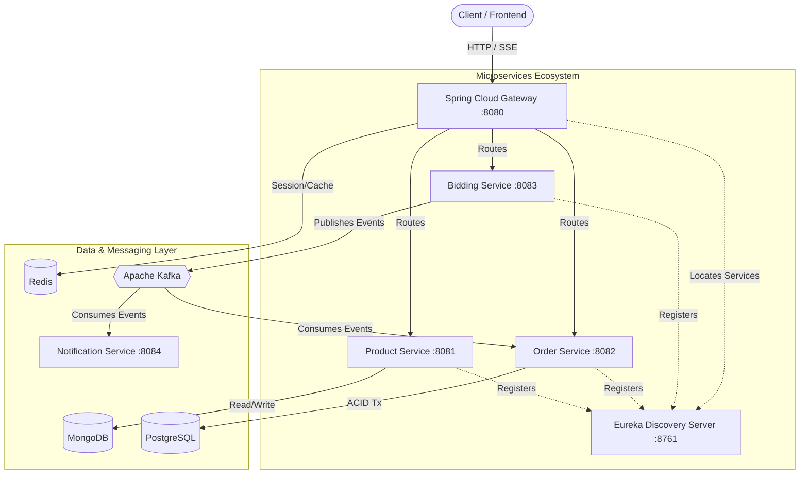

# 🏗️ BidCraft: E-Commerce & Live Auction Platform

## Intro
A highly scalable, distributed system designed to handle live auction concurrency and traditional e-commerce checkouts. This project serves as a comprehensive exploration of monolith-to-microservice transitions, demonstrating enterprise-grade architectural patterns.

## Project overview
BidCraft is built to implement and master complex system design patterns in a microservices ecosystem. It transitions from a core domain foundation into a fully event-driven, reactive architecture. The platform handles both static product catalogs and high-speed, concurrent live bidding events, ensuring data consistency across polyglot databases (MongoDB and PostgreSQL) and decoupling internal systems via asynchronous message brokers (Kafka).

## Architecture diagram


## Technologies/text-stack
* **Language & Framework:** Java 25, Spring Boot 4.1.x, Spring Cloud 2025.1.2
* **Databases:** PostgreSQL (Relational/ACID), MongoDB (NoSQL/Document)
* **Message Broker:** Apache Kafka (Event-Driven Architecture)
* **Caching & Sessions:** Redis
* **Microservices Tools:** Spring Cloud Gateway, Netflix Eureka (Service Discovery), OpenFeign
* **Build Tool:** Maven
* **Infrastructure:** Docker & Docker Compose

## Features
* **Polyglot Persistence:** Utilizing the right database for the specific domain (MongoDB for dynamic product catalogs, PostgreSQL for transactional orders).
* **API Gateway & Routing:** Centralized entry point managing routes and load balancing.
* **Service Discovery:** Dynamic service registration using Netflix Eureka.
* **Real-Time Bidding:** Live broadcasts and reactive endpoints powered by Spring WebFlux and Server-Sent Events (SSE).
* **Event-Driven Processing:** Asynchronous decoupling using Apache Kafka for order generation and notifications after an auction ends.

## The process
The project was systematically developed across several architectural phases:
1. **Domain & Polyglot Persistence:** Defining bounded contexts (Product, Order) and mapping them to appropriate databases.
2. **Microservices & API Gateway:** Isolating runtime processes and setting up Netflix Eureka and Spring Cloud Gateway.
3. **Caching & High Availability:** Integrating Redis for fast, read-through caching.
4. **Real-Time Communication:** Implementing Spring WebFlux for low-latency live bidding.
5. **Event-Driven Architecture:** Introducing Kafka to decouple services, allowing the Bidding Service to asynchronously notify the Order Service upon auction completion.

## What I Learned
* Designing and orchestrating a multi-module microservices architecture from scratch.
* Handling distributed system challenges like service discovery, gateway routing, and inter-service communication (OpenFeign).
* Configuring and managing polyglot persistence, ensuring data is stored optimally based on access patterns.
* Implementing asynchronous, event-driven communication using Apache Kafka and resolving serialization/deserialization challenges between producer and consumer services.

## How it can be improved
* **CQRS & Event Sourcing:** Implement full Command/Query Responsibility Segregation for a perfect audit trail of bidding history.
* **Resiliency & Observability:** Add Resilience4j for circuit breakers and bulkheads, and integrate Micrometer/Prometheus/Grafana for distributed tracing and metrics.
* **Frontend Dashboard:** Develop a modern, minimalist Web GUI visualizing live bids (via WebSockets/SSE) alongside sleek product grids.

## Running the project/setup instruction

### Prerequisites
* Java 25 & Maven installed
* Docker and Docker Compose (recommended for running infrastructure)

### Setup Steps
1. **Clone the repository:**
   ```bash
   git clone https://github.com/Bhomaramsuthar/e-commerce-live-auction.git
   cd e-commerce-live-auction
   ```

2. **Start Infrastructure with Docker Compose:**
   ```bash
   docker-compose up -d
   ```
   *This spins up PostgreSQL, Redis, Zookeeper, and Kafka.*

3. **Run the Services (Strict Boot Order):**
   Navigate to each service directory and start them in the following order (ensure the registry is active before clients boot).

   ```bash
   # 1. Start Service Registry
   cd discovery-server && mvn spring-boot:run
   
   # 2. Start API Gateway
   cd ../gateway-service && mvn spring-boot:run
   
   # 3. Start Product Service
   cd ../product-service && mvn spring-boot:run
   
   # 4. Start Order Service
   cd ../order-service && mvn spring-boot:run
   
   # 5. Start Bidding Service
   cd ../bidding-service && mvn spring-boot:run
   ```

## video/Screenshot
*(Add link to video demonstration or project screenshots here)*