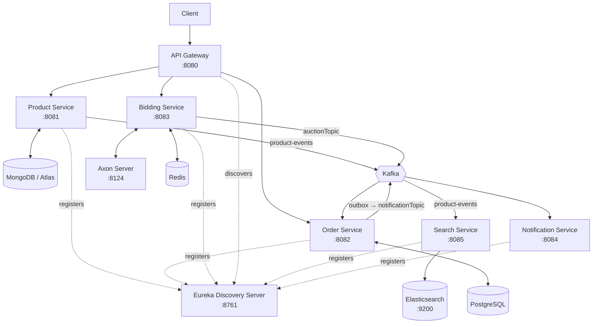

# BidCraft — E-Commerce & Live Auction Platform

BidCraft is a microservices learning project that combines a product catalogue, orders, live bidding, search, and notifications. It demonstrates service discovery, asynchronous messaging, CQRS/event sourcing, an outbox pattern, and a search projection while using the database best suited to each workload.

## Architecture



MongoDB is the product catalogue's source of truth. Elasticsearch is a disposable read/search projection: it can be recreated from Product Service whenever required.

## Services

| Service | Port | Responsibilities |
| --- | ---: | --- |
| Discovery Server | 8761 | Eureka service registry. |
| API Gateway | 8080 | Eureka-based routing for `/api/product/**`, `/api/order/**`, and `/api/bidding/**`; Redis-backed web sessions; a placeholder Bearer-token filter. |
| Product Service | 8081 | MongoDB product catalogue, Redis caching, SKU uniqueness, and product-event publishing. |
| Order Service | 8082 | PostgreSQL orders, Product Service verification through OpenFeign, transactional outbox, and auction-event consumption. |
| Bidding Service | 8083 | REST/SSE bidding, Kafka auction completion events, and Axon CQRS/event sourcing with a Redis read model. |
| Notification Service | 8084 | Consumes notification events and logs the email-notification action. |
| Search Service | 8085 | Consumes product events, maintains the Elasticsearch projection, and exposes fuzzy product search. |

The Search and Notification services currently are accessed directly; they do not have Gateway routes.

## Technology stack

| Area | Technology |
| --- | --- |
| Language | Java 25 for Product, Order, Bidding, Notification, Discovery, and Search; Java 17 for Gateway |
| Frameworks | Spring Boot 4.1.x / Spring Cloud 2025.1.2; Gateway remains on Spring Boot 3.3.5 / Spring Cloud 2023.0.3 |
| Service discovery and client calls | Netflix Eureka and OpenFeign |
| Messaging | Apache Kafka 4 client with Confluent Kafka 7.3.2 broker image |
| Catalogue and search | MongoDB / MongoDB Atlas and Elasticsearch 9.4.2 |
| Transactional data | PostgreSQL |
| Cache and read models | Redis 7.2 |
| CQRS and event sourcing | Axon Framework 4.10 and Axon Server |
| Build | Maven |
| Observability | Spring Boot Actuator metrics and health endpoints in Product and Search services |

## Product catalogue and search

### Product writes

`Product` documents contain an ID, a required `sku`, name, description, price, and flexible `dynamicAttributes`. Product Service normalizes SKUs to uppercase and creates a sparse unique MongoDB index on `sku`.

- Missing SKU on `POST` or full `PUT` returns `400 Bad Request`.
- A duplicate SKU returns `409 Conflict`.
- The MongoDB unique index is the final protection against concurrent duplicate creates.

Every successful catalogue change produces a JSON event on `product-events`:

```json
{
  "eventType": "PRODUCT_CREATED",
  "productId": "...",
  "name": "iPhone 16",
  "description": "256 GB, black",
  "price": 79999,
  "dynamicAttributes": {
    "storage": "256GB"
  }
}
```

`PRODUCT_UPDATED` and `PRODUCT_DELETED` are published for updates and deletion. Search Service consumes these events, performs idempotent document writes/deletes, retries transient failures, and sends exhausted messages to a `-dlt` retry topic.

### Elasticsearch projection

On startup, Search Service creates the `products` index and mapping when it does not already exist. The projection indexes `name`, `description`, `price`, and flattened dynamic attributes. Search uses fuzzy multi-match across `name` (boosted), `description`, and dynamic attributes, with price filtering, pagination, and sorting.

Elasticsearch must run the same major version as the client resolved by Spring Boot 4.1. The Compose configuration uses Elasticsearch **9.4.2** for that reason.

## APIs

Examples use direct service ports. Calls through Gateway require an `Authorization: Bearer <token>` header; the present gateway filter checks only that the header has the Bearer format.

### Product Service — `http://localhost:8081/api/product`

| Method | Path | Description |
| --- | --- | --- |
| `POST` | `/` | Create a product. |
| `GET` | `/` | List products. |
| `GET` | `/{id}` | Get one product. |
| `PUT` | `/{id}` | Replace a product; SKU is required. |
| `PATCH` | `/{id}` | Partially update a product. |
| `DELETE` | `/{id}` | Delete a product and publish `PRODUCT_DELETED`. |

Create example:

```bash
curl -X POST http://localhost:8081/api/product \
  -H "Content-Type: application/json" \
  -d '{
    "sku":"IPHONE-16-256-BLK",
    "name":"iPhone 16",
    "description":"256 GB, black",
    "price":79999,
    "dynamicAttributes":{"storage":"256GB","colour":"black"}
  }'
```

### Search Service — `http://localhost:8085/api/search`

| Method | Path | Description |
| --- | --- | --- |
| `GET` | `/products` | Fuzzy multi-field search. Supports `query`, `minPrice`, `maxPrice`, `page`, `size` (1–100), `sort` (`_score`, `price`, `name`), and `direction` (`asc`, `desc`). |
| `POST` | `/products/rebuild` | Rebuild the Elasticsearch `products` projection from Product Service. |

```bash
curl "http://localhost:8085/api/search/products?query=iphon&minPrice=50000&maxPrice=150000&page=0&size=20&sort=_score&direction=desc"

curl -X POST http://localhost:8085/api/search/products/rebuild
```

The rebuild endpoint reads the catalogue through Product Service (`product-catalog.url`, default `http://localhost:8081/api/product`); it never reads MongoDB directly.

### Order Service — `http://localhost:8082/api/order`

`POST`, `GET /{id}`, `GET`, `PUT /{id}`, `PATCH /{id}`, and `DELETE /{id}` are available. Order creation verifies referenced products through Product Service, persists the order and an outbox record in one transaction, then the scheduled outbox poller publishes to `notificationTopic`.

### Bidding Service — `http://localhost:8083/api/bidding`

| Method | Path | Description |
| --- | --- | --- |
| `POST` | `/{productId}` | Publish a bid to the live stream. |
| `GET` | `/stream/{productId}` | Subscribe to live bids with Server-Sent Events. |
| `POST` | `/{productId}/end?winningId=…&finalPrice=…` | Publish an auction-ended event to `auctionTopic`. |
| `POST` | `/commands/create?productId=…&startingPrice=…` | Create an Axon auction aggregate. |
| `POST` | `/commands/bid?auctionId=…&bidderId=…&amount=…` | Place an Axon command. |
| `GET` | `/queries/{auctionId}` | Read the projected auction status. |

### Operations endpoints

Product Service and Search Service expose `/actuator/health`, `/actuator/info`, and `/actuator/metrics`.

## Run locally

### Prerequisites

- Docker Desktop and Docker Compose
- Java 25 and Maven for most services
- Java 17 is sufficient for Gateway, although a newer JDK can generally run it
- A MongoDB instance or MongoDB Atlas connection string for Product Service

### 1. Configure MongoDB

Product Service uses `MONGODB_URI`; without it, it defaults to `mongodb://localhost:27017/bidcraft_products`.

For Atlas, set the variable before starting Product Service. Do not commit its value.

```powershell
$env:MONGODB_URI = "mongodb+srv://<user>:<password>@<cluster>/bidcraft_products"
```

### 2. Start local infrastructure

```bash
docker compose up -d
```

This starts Redis, Axon Server, PostgreSQL, ZooKeeper, Kafka, and Elasticsearch. MongoDB is deliberately not part of Compose because Product Service can use MongoDB Atlas.

If Elasticsearch 8.x was already running from an older Compose configuration, recreate it so the 9.4.2 image is used:

```bash
docker compose up -d --force-recreate elasticsearch
curl http://localhost:9200
```

The version returned by the final command must be 9.x.

### 3. Start services

Open a terminal per service and run Maven from that service directory. Start Discovery Server first; start Product Service before Search Service when using the rebuild endpoint.

```bash
cd discovery-server && mvn spring-boot:run
cd gateway-service && mvn spring-boot:run
cd product-service && mvn spring-boot:run
cd order-service && mvn spring-boot:run
cd bidding-service && mvn spring-boot:run
cd notification-service && mvn spring-boot:run
cd search-service && mvn spring-boot:run
```

After Product and Search services are running, rebuild search once to index any products that existed before Search Service started:

```bash
curl -X POST http://localhost:8085/api/search/products/rebuild
```

## Development notes

- The repository is a collection of independent Maven services, not a root Maven reactor; run Maven inside the desired service directory.
- Product and Search Service include application-context tests. Run them with `mvn test` from their respective directories.
- Existing MongoDB documents without a `sku` are intentionally left untouched by the sparse unique index. Give legacy records distinct SKUs before treating them as new catalogue records; the application does not delete data automatically.
- The current notification implementation logs an email action. JWT signature verification, real email delivery, Gateway routes for Search/Notification, and broader resiliency/tracing remain future enhancements.

## License

No license has been specified for this repository.
